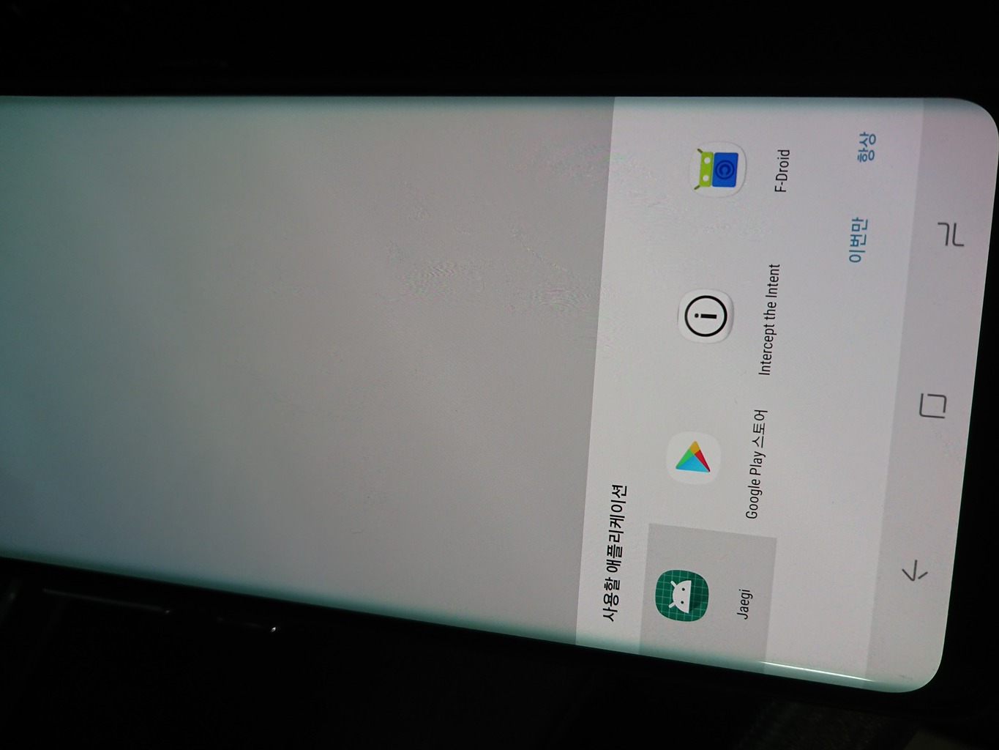
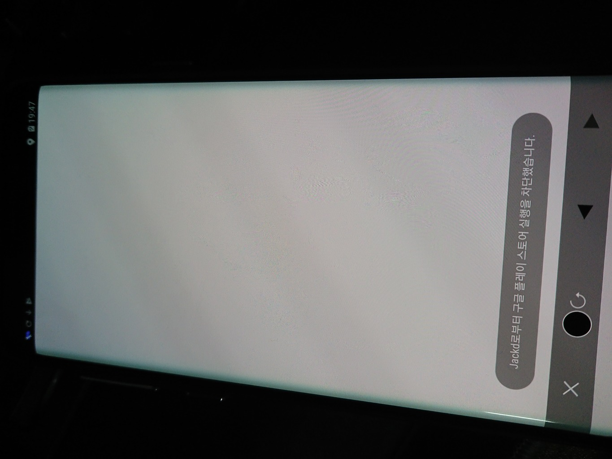

# Jaegi

Jaegi는 게이 데이팅 앱 [Jack'd](http://jackd.mobi) 에서 구글 플레이 스토어 팝업이 뜨는 것을 막아주는 애플리케이션입니다.

# 설치 방법

**동작이 더욱 가벼워진 v2가 릴리즈 되었습니다. 기존 버전 사용하시는 분들은 업데이트 해 주세요.** 

이 저장소의 [Releases](https://github.com/unstabler/Jaegi/releases) 페이지에서 최신 버전의 apk를 다운받을 수 있습니다.

# 사용 방법 

1. Jack'd를 켜고, 하단에 뜨는 앱 설치 광고를 누릅니다.

2. 앱 선택 창이 뜨면, Jaegi를 선택하고 **항상** 을 누릅니다.

3. 다음부터는 Jack'd 가 구글 플레이 스토어를 띄우려는 시도가 차단됩니다.

# License / Author

- 작성자: Gyuhwan Park(unstabler) / [twitter: @_unstabler](https://twitter.com/_unstabler)

- **이 애플리케이션은 CC0 1.0 Universal 라이선스 하에 배포됩니다. (저작권 포기)**

- **이 애플리케이션을 사용함으로써 일어나는 문제에 대해서 이 애플리케이션의 작성자는 일체 책임을 지지 않습니다.**

